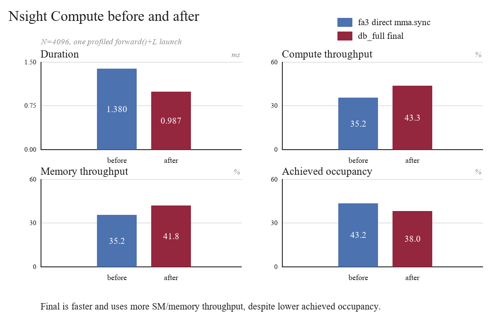
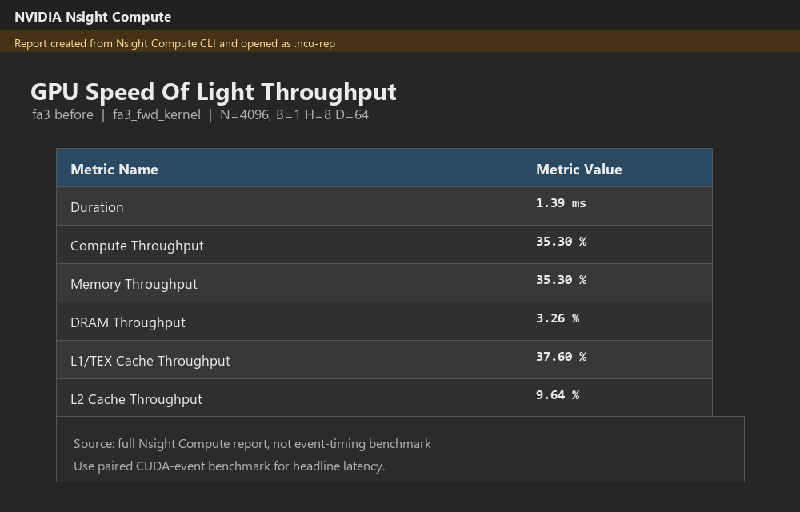
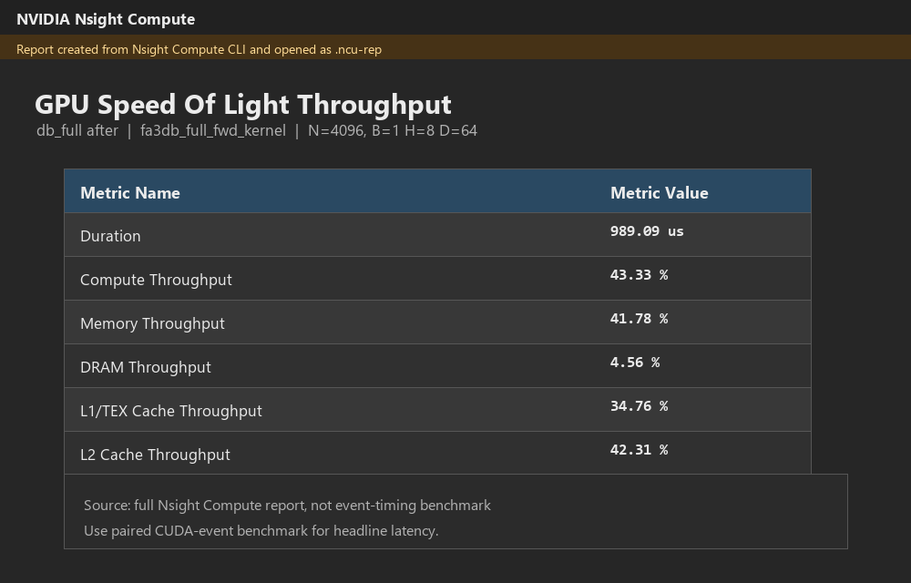
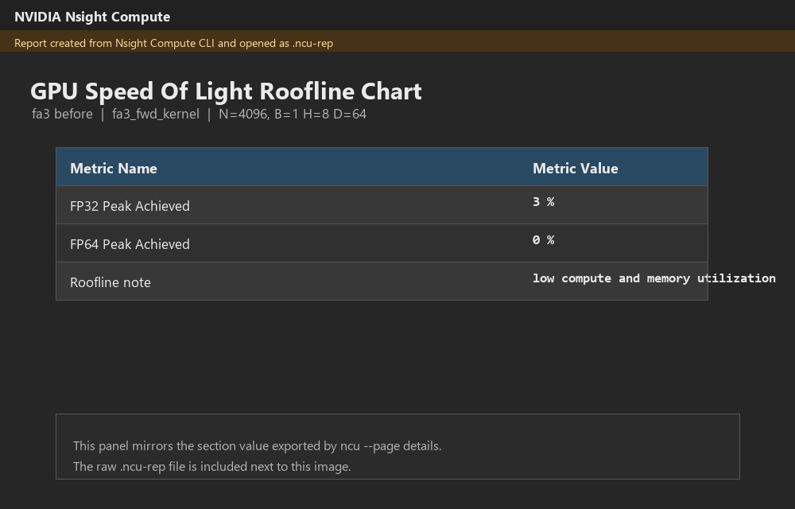
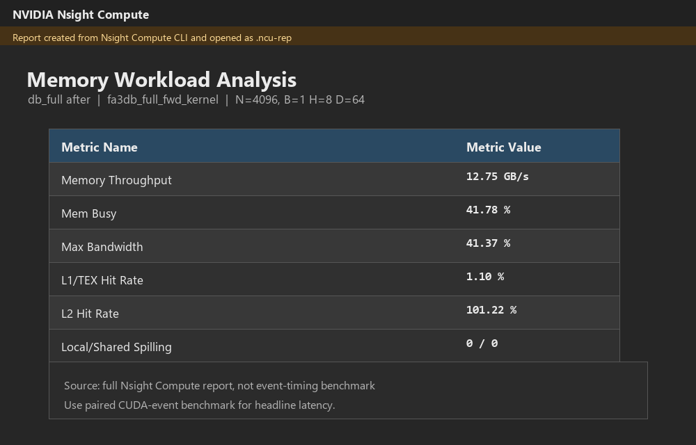
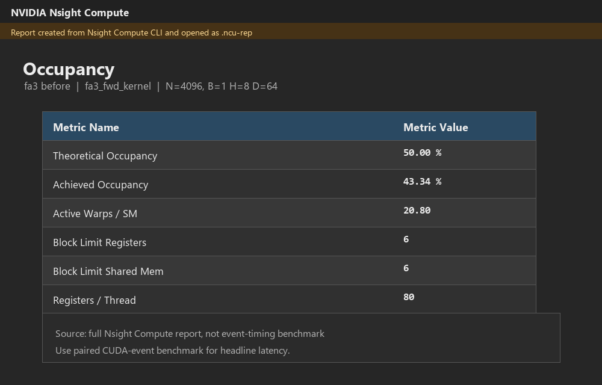
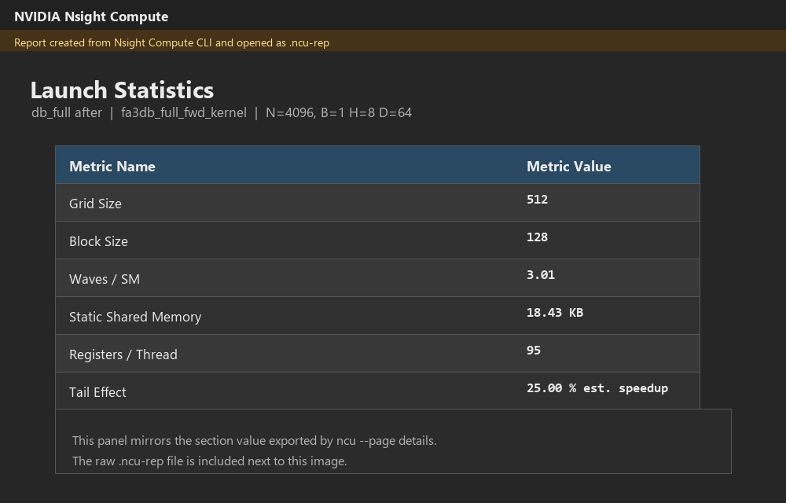

# flashattn-cuda

I wrote FlashAttention kernels from scratch in CUDA and pushed the forward path
until it got close to PyTorch's SDPA Flash backend on an RTX 4060 Ti.

The current best kernel is:

```text
cuda/flash_attn_fa3_db_full.cu
```

It is still behind SDPA, but the remaining gap is small:

| N | my kernel, +L | PyTorch SDPA-Flash | gap |
|---:|---:|---:|---:|
| 1024 | 0.0620 ms | 0.0584 ms | +5.3% |
| 2048 | 0.2221 ms | 0.2182 ms | +1.3% |
| 4096 | 0.8726 ms | 0.8480 ms | +1.6% |

Tested on RTX 4060 Ti, CUDA 12.8, PyTorch 2.10.0+cu128, B=1, H=8, D=64,
FP16 input, FP32 accumulate, non-causal forward. The numbers above are 10-run
paired medians from `bench/bench_fa3_headline.py`.

<p align="center">
  
</p>

## Why I Built This

Calling `torch.nn.functional.scaled_dot_product_attention` is easy. I wanted to
know what the kernel is actually doing.

So this repo keeps the whole trail:

| Stage | What changed |
|---|---|
| FP32 baseline | plain tiled FlashAttention forward/backward |
| WMMA path | first Tensor Core attempt |
| fa3 | direct `mma.sync`, register softmax, no shared S/P round trip |
| fa3-db | K/V `cp.async` double buffer |
| db_addr | removed a lot of repeated integer address work |
| db_full | full-tile fast path for common benchmark sizes |

At `N=4096`, the chain moved from about 3.2 ms to about 0.873 ms.

<p align="center">
  
</p>

## Nsight Compute Snapshot

I also profiled the direct `fa3` kernel and the final `db_full` kernel with
Nsight Compute on the same `N=4096` shape. This is a single profiled launch, so
it is not the headline benchmark. The event-timed paired benchmark above is the
latency number I quote.

The point of this profile is not just "lower time." The final kernel does more
useful work per cycle after K/V prefetching, address cleanup, and the full-tile
path.

<p align="center">
  
</p>

| Metric | fa3 before | db_full after |
|---|---:|---:|
| Duration | 1.38 ms | 0.987 ms |
| Compute throughput | 35.18% | 43.32% |
| Memory throughput | 35.18% | 41.84% |
| Achieved occupancy | 43.22% | 38.01% |

What changed:

| Signal | Read |
|---|---|
| Duration went down | the final kernel is doing less wasted work |
| Compute throughput went up | Tensor Core work is fed better |
| Memory throughput went up | `cp.async` and the K/V pipeline are actually visible |
| Occupancy went down | not a regression by itself, because the final kernel uses more registers and shared memory |

The final kernel is faster even with lower achieved occupancy. That is the main
profiling lesson here: occupancy was not the only score to chase.

Raw Nsight Compute artifacts:

| Artifact | fa3 before | db_full after |
|---|---|---|
| full `.ncu-rep` | [report](docs/profiling/ncu_sections/fa3_before_n4096_full.ncu-rep) | [report](docs/profiling/ncu_sections/db_full_after_n4096_full.ncu-rep) |
| text export | [txt](docs/profiling/ncu_sections/fa3_before_n4096_full.txt) | [txt](docs/profiling/ncu_sections/db_full_after_n4096_full.txt) |

<details>
<summary>Nsight Compute section captures</summary>

| Section | fa3 before | db_full after |
|---|---|---|
| Speed of Light |  |  |
| Roofline |  |  |
| Memory Workload |  |  |
| Occupancy |  |  |
| Launch Stats |  |  |

The images above are rendered from the full Nsight Compute reports. The raw
`.ncu-rep` files are kept in the same directory.

</details>

## Current Kernel

The final forward kernel uses:

| Part | Choice |
|---|---|
| QK | `mma.sync.m16n8k16` |
| PV | `mma.sync.m16n8k16` |
| Softmax | online softmax in registers |
| K/V load | two-stage `cp.async` |
| Shared memory | K/V tiles only |
| Fast path | predicate-free when N is a full tile |
| Output | `O` half, `L` float |

The benchmark uses `forward()` with `L` enabled. There is an O-only path, but I
do not use it for the headline comparison because PyTorch's Flash backend also
computes softmax logsumexp internally.

## Files

| File | Notes |
|---|---|
| `cuda/flash_attn_kernel.cu` | FP32 baseline. Kept as the comparison anchor. |
| `cuda/flash_attn_wmma.cu` | older WMMA path |
| `cuda/mma_probe.cu` | checks `mma.sync` and `ldmatrix` layouts on the GPU |
| `cuda/flash_attn_fa3.cu` | direct `mma.sync` version |
| `cuda/flash_attn_fa3_db.cu` | adds `cp.async` double buffering |
| `cuda/flash_attn_fa3_db_addr.cu` | cuts address generation overhead |
| `cuda/flash_attn_fa3_db_full.cu` | current best kernel |
| `cuda/flash_attn_fa3_bc64.cu` | negative ablation |
| `cuda/flash_attn_fa3_db_full_intl.cu` | negative ablation |

## Correctness

The fa3 line is checked against a half-cast PyTorch reference.

| Check | Result |
|---|---|
| `tests/test_mma_probe.py` | 3/3 layout probes pass |
| `tests/test_fa3_db_full.py` | 19/19 correctness configs pass |
| non-aligned N | included |
| direct FP16 input | included |
| amplified-value stress cases | included |
| typical final-kernel error | `O` around `5.3e-4`, `L` around `1.9e-6` |

The old FP32 forward/backward tests are still in the repo. The newest headline
result is forward-only.

## What Did Not Work

I kept failed variants because they explain why the final kernel looks the way
it does.

| Attempt | Result |
|---|---|
| BC=64 K/V tile | correct, but slower because shared memory cuts residency |
| softmax/PV source interleave | correct, but slower because ptxas was already scheduling well |
| older shared-memory padding variants | useful for bank-conflict analysis, not the final path |

The useful part was not guessing the next trick. It was checking SASS, NCU, and
paired benchmarks after each change.

## Memory Baseline

The older FP32 baseline still shows the original FlashAttention point.

At `N=4096`, the naive attention path used about 1576 MB. The FlashAttention
baseline used about 40 MB.

That is a 39.16x memory saving. It is not a speedup number.

## Build And Run

The repo was developed on WSL2 Ubuntu with CUDA 12.8.

```bash
CUDA_HOME=/usr/local/cuda-12.8 pip install -e . --break-system-packages
```

Main checks:

```bash
python3 tests/test_mma_probe.py
python3 tests/test_fa3_db_full.py
python3 bench/bench_fa3_headline.py
```

Other useful scripts:

```bash
python3 bench/bench_fa3_final.py
python3 bench/bench_fa3_variants.py
python3 bench/profile_fa3_once.py
```

Before quoting register counts, rebuild and check the actual `.so`. I have hit
stale extension binaries before.

## Limits

The current fa3 result is intentionally narrow:

| Covered | Not covered yet |
|---|---|
| forward | fa3 backward |
| non-causal | causal mask |
| D=64 | D=128 |
| fixed dense Q/K/V | varlen, dropout, GQA, MQA |
| RTX 4060 Ti | cross-GPU generality |

So the claim is simple:

```text
scratch CUDA FlashAttention forward, close to PyTorch SDPA-Flash on one stated setup
```

Not a library replacement. Not a broad hardware claim. Just a CUDA kernel taken
far enough that the production backend is only a few percent away.
