# Flashattn-cuda

This is project FlashAttention forward/backward kernels implemented from scratch in CUDA(profiling it and optimizing with WMMA)
finally,, profiled on RTX 4060 Ti with Nsight Compute.

## motivation & goal

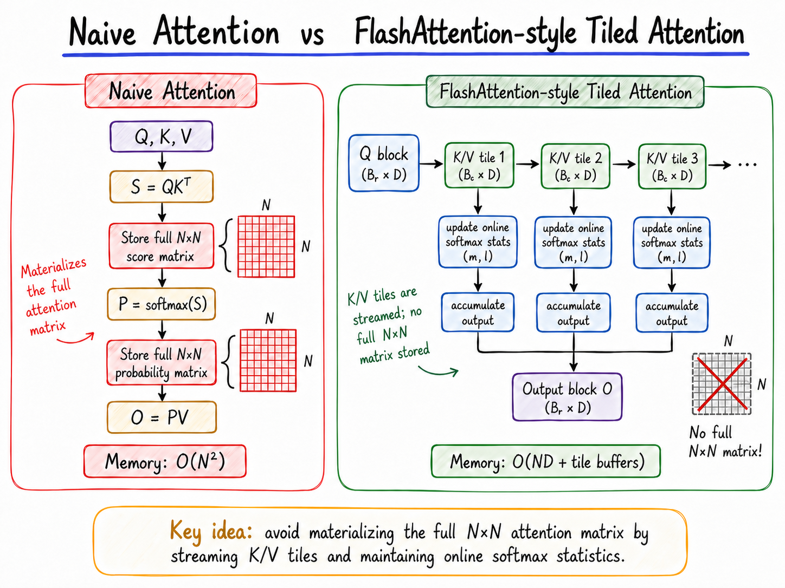

### motivation

Transformer attention computes a full $N \times N$ score matrix, which blows up memory at long sequences.
at B=32, H=8, seq_len=4096 in FP32, that's ~17GB just for attention scores.
FlashAttention avoids this by tiling Q/K/V into SRAM-sized blocks and computing softmax on the fly, never materializing the full matrix.

i wanted to understand how this actually works at the kernel level, not just call `F.scaled_dot_product_attention`.
so i implemented it from scratch in CUDA, profiled it with ncu to find bottlenecks, tried 6 optimizations,


### Goal
Scratch-implement FlashAttention → profile with ncu → optimize (6 attempts) 
 -> analyze kernel-level performance on
RTX 4060 Ti (discrete GDDR6).
Jetson AGX Orin profiling is future work.


## algorithm

### Forward (Algorithm 1)

1. **Tile Q into row blocks ($B_r=32$), K/V into column blocks ($B_c=32$)**
2. **Load Q row into registers** (stays fixed across all K/V blocks)
3. **For each K/V block:**
   - Collaboratively load K, V tiles into shared memory (16KB total)
   - Compute $S = Q \cdot K^T \times \text{scale}$
   - Online softmax update: $m_{new} = \max(m_{old}, m_{block})$, rescale previous accumulator by $e^{m_{old} - m_{new}}$, accumulate new block
4. **Normalize:** $O = \text{acc} / l_i$
5. **Store logsumexp** $L = m + \log(l)$ for backward pass

Thread model: one thread per Q row, grid = $(⌈N/B_r⌉,\; B \times H)$, block = $(B_r,)$.

### Backward (Algorithm 2)

The backward pass computes $dQ$, $dK$, $dV$ without ever materializing the full $N \times N$ attention matrix by **recomputing** $S$ and $P$ from the stored logsumexp $L$.

Three kernels:

1. **Precompute D:** $D_i = \text{rowsum}(dO \odot O)$ — simple per-row dot product
2. **dQ kernel:** One thread per Q row, iterates over all K/V blocks. Recomputes $P = e^{QK^T \times \text{scale} - L}$, then accumulates $dQ \mathrel{+}= P(dO \cdot V^T - D) \times K \times \text{scale}$
3. **dK/dV kernel:** One thread per K/V row, iterates over all Q blocks. Recomputes $P$, then accumulates $dV \mathrel{+}= P^T \times dO$ and $dK \mathrel{+}= (P(dO \cdot V^T - D))^T \times Q \times \text{scale}$

Same tiling strategy ($B_r=32$, $B_c=32$) and shared memory collaborative loading as forward.


## Correctness

validated against PyTorch reference (torch.matmul + F.softmax) using max absolute error.
all forward/backward tests under 1e-6 max diff (FP32).
backward checks dQ, dK, dV independently to avoid hiding errors in a single aggregate.

### Forward — 9/9 passed

```
[PASS] B=1, H=1, N=   32, D=64  |  max_diff=4.768372e-07
[PASS] B=1, H=1, N=   64, D=64  |  max_diff=3.874302e-07
[PASS] B=1, H=1, N=  128, D=64  |  max_diff=4.768372e-07
[PASS] B=1, H=1, N=   63, D=64  |  max_diff=4.768372e-07
[PASS] B=1, H=1, N=  127, D=64  |  max_diff=4.470348e-07
[PASS] B=2, H=4, N=  256, D=64  |  max_diff=4.768372e-07
[PASS] B=2, H=8, N=  512, D=64  |  max_diff=6.854534e-07
[PASS] B=1, H=1, N= 1024, D=64  |  max_diff=3.576279e-07
[PASS] B=1, H=1, N= 2048, D=64  |  max_diff=4.023214e-07
```

### Backward — 9/9 passed

```
[PASS] B=1, H=1, N=   32, D=64  |  dQ_diff=4.768372e-07  dK_diff=4.172325e-07  dV_diff=3.576279e-07
[PASS] B=1, H=1, N=   64, D=64  |  dQ_diff=5.960464e-07  dK_diff=5.364418e-07  dV_diff=4.768372e-07
[PASS] B=1, H=1, N=  128, D=64  |  dQ_diff=4.768372e-07  dK_diff=5.960464e-07  dV_diff=3.576279e-07
[PASS] B=1, H=1, N=   63, D=64  |  dQ_diff=6.556511e-07  dK_diff=5.364418e-07  dV_diff=4.204921e-07
[PASS] B=1, H=1, N=  127, D=64  |  dQ_diff=6.556511e-07  dK_diff=5.960464e-07  dV_diff=3.576279e-07
[PASS] B=2, H=4, N=  256, D=64  |  dQ_diff=7.152557e-07  dK_diff=1.072884e-06  dV_diff=4.768372e-07
[PASS] B=2, H=8, N=  512, D=64  |  dQ_diff=4.768372e-07  dK_diff=4.768372e-07  dV_diff=3.278255e-07
[PASS] B=1, H=1, N= 1024, D=64  |  dQ_diff=4.768372e-07  dK_diff=3.725290e-07  dV_diff=3.725290e-07
[PASS] B=1, H=1, N= 2048, D=64  |  dQ_diff=4.470348e-07  dK_diff=4.470348e-07  dV_diff=3.278255e-07
```
the reason why Batch is 1. because the kernel processes each (batch, head) pair independently increasing B only launches more identical blocks without changing `per-kernel` behavior. i just fixed B=1 to isolate sequence length scaling. also 
tests cover single-block, multi-block, non-aligned sequence lengths, and multi-batch/multi-head configurations.

## Live Demo

### Naive O(N²) vs FlashAttention @ N=8192

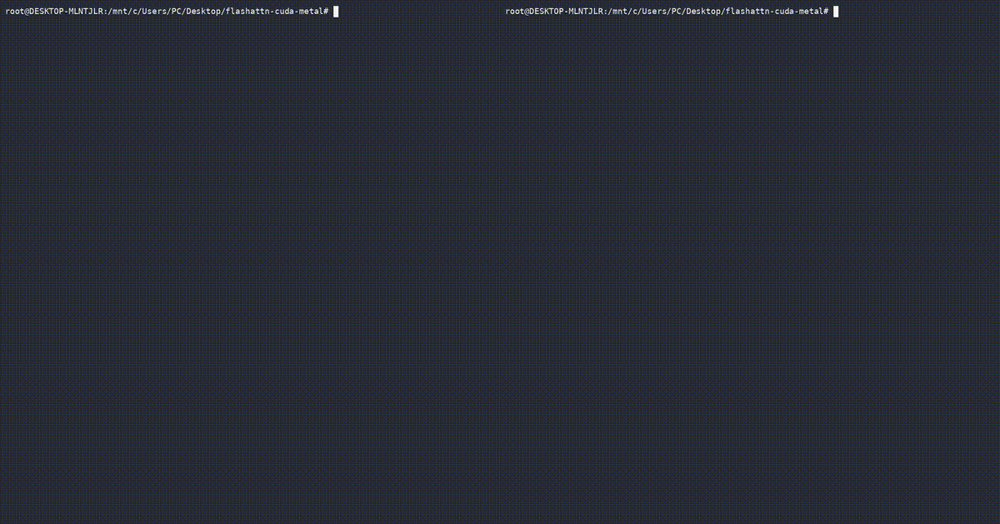

| | Per iter | Peak memory |
|---|---|---|
| Naive  | 287 ms | 8666 MB |
| Flash  |  41 ms |  118 MB |
| Ratio  | **7×** | **73×** |

Config: B=1, H=8, D=64, FP32, 200 iterations, RTX 4060 Ti 8GB.

### Naive OOM @ N=16384

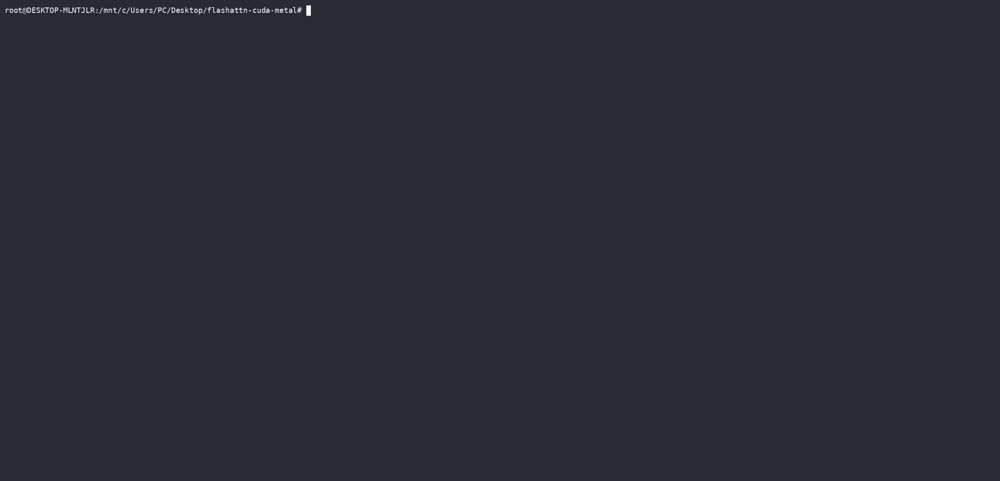

At N=16384, naive attention requires ~8.6GB to materialize the N×N score matrix, exceeding the 8GB capacity of an RTX 4060 Ti. FlashAttention processes the same workload in 235MB.


## Benchmark Results


### Forward

**GPU:** NVIDIA GeForce RTX 4060 Ti | **Precision:** FP32 | **Config:** B=1, H=8, D=64

| Seq Len | Naive (ms) | Flash (ms) | SDPA (ms) | Speedup (vs Naive) | Naive Mem | Flash Mem | Mem Save |
|---------|-----------|-----------|-----------|-------------------|-----------|-----------|----------|
| 128     | 0.62      | 0.12      | 0.06      | 5.26×             | 10.6 MB   | 9.1 MB    | 1.16×    |
| 256     | 0.18      | 0.12      | 0.06      | 1.56×             | 16.1 MB   | 10.1 MB   | 1.59×    |
| 512     | 0.19      | 0.25      | 0.14      | 0.75×             | 36.2 MB   | 12.1 MB   | 2.98×    |
| 1024    | 1.59      | 0.94      | 0.45      | 1.69×             | 112.2 MB  | 16.2 MB   | 6.94×    |
| 2048    | 6.94      | 3.06      | 1.58      | 2.27×             | 408.2 MB  | 24.2 MB   | 16.88×   |
| 4096    | 27.87     | 11.18     | 6.20      | 2.49×             | 1576.4 MB | 40.2 MB   | **39.16×** |

torch SDPA (`F.scaled_dot_product_attention`) is included as a production-grade reference.
our scratch kernel is ~2x slower than SDPA, which is expected since SDPA uses optimized backends (flash/efficient/math).
this project is not trying to beat production kernels.

### Backward

**GPU:** NVIDIA GeForce RTX 4060 Ti | **Precision:** FP32 | **Config:** B=1, H=8, D=64

| Seq Len | Naive (ms) | Flash (ms) | SDPA (ms) | Speedup (vs Naive) | Naive Mem | Flash Mem | Mem Save |
|---------|-----------|-----------|-----------|-------------------|-----------|-----------|----------|
| 128     | 0.24      | 0.26      | —         | 0.94×             | 12.6 MB   | 10.1 MB   | 1.25×    |
| 256     | 0.43      | 0.52      | —         | 0.82×             | 21.6 MB   | 12.1 MB   | 1.78×    |
| 512     | 0.84      | 1.75      | —         | 0.48×             | 55.2 MB   | 16.2 MB   | 3.41×    |
| 1024    | 2.38      | 5.59      | —         | 0.43×             | 182.2 MB  | 24.2 MB   | 7.53×    |
| 2048    | 8.79      | 17.96     | —         | 0.49×             | 676.2 MB  | 40.2 MB   | 16.80×   |
| 4096    | 34.62     | 69.50     | —         | 0.50×             | 2624.4 MB | 72.4 MB   | **36.26×** |

- both of them (fw/bwd) are saving memory 36-39x at seq_len=4096.
- backward is slower than naive because of occupancy 7.9% and resiget spill (you can see profiling section below.)
- forward benefits from avoiding full attention materialization and reducing memory traffic.
backward saves memory (36x) but recomputation + register pressure hurts latency.
the strongest result is memory scaling: naive grows O(N²) while flash stays nearly flat.

## Profiling (Nsight Compute)

in this section. i focused on 4 metrics per kernel : 

- **GPU Speed of Light (SOL)**: how much of the GPU's peak compute and memory bandwidth is actually used. If both are under 60%, the kernel is stalling because there aren't enough warps to hide memory latency.
- **Roofline**: plots the kernel's achieved throughput against hardware limits.
$$\text{Attainable Performance} = \min(\text{Peak FLOP/s},\; \text{Peak Bandwidth} \times \text{Arithmetic Intensity})$$
$$\text{Arithmetic Intensity} = \frac{\text{FLOPs}}{\text{Bytes Accessed}}$$
- **Memory Workload**: shows memory access patterns. High local memory % means registers are spilling to L1/global memory, adding extra latency.
- **Occupancy**: ratio of active warps to the hardware max. Low occupancy means the SM can't switch between enough warps to keep the pipeline busy.

entire kernels are profiled with `ncu --set full --launch-count 1` on N=1024, B=1, H=8, D=64.

### Kernel Comparison Summary

| Metric | Forward | Backward (dQ) | Backward (dK/dV) |
|--------|---------|---------------|-------------------|
| Duration | 1.14 ms | 1.53 ms | 5.64 ms |
| Compute (SM) Throughput | 25.30% | 22.82% | 17.95% |
| Memory Throughput | 25.30% | 73.89% | 32.31% |
| Achieved Occupancy | 7.90% | 8.99% | 9.44% |
| FP32 Peak Achieved | 10% | 11% | 4% |
| Block Limit (Shared Mem) | 5 | 5 | 5 |
| Register Spill (Local Mem) | 28.57% | 26.39% | 71.88% |

### Forward Kernel

| Before (FP32 Baseline) | After (WMMA+half2 v1 before padding) |
|---|---|
|  | 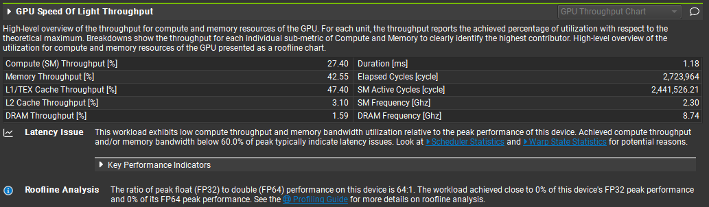 |
| Compute 25.30%, Memory 25.30% | Compute 27.40%, Memory 42.55% |
|  | 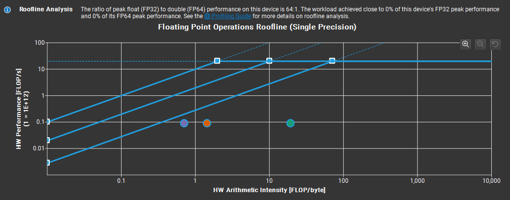 |
| 10% of FP32 peak | 0% of FP32 peak, Tensor Core 4.54% |
|  | 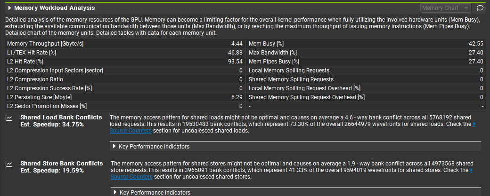 |
| Register spill 28.57% | Register spill 0%, bank conflict 4.6-way |
|  | 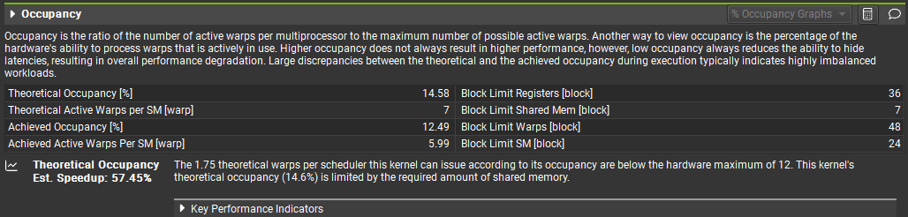 |
| Occupancy 7.90% | Occupancy 12.49% |

### Forward Optimization Summary

tried 6 things to make the forward kernel faster:

| # | what i tried | result | why it failed/worked |
|---|---|---|---|
| 1 | tile 32→16 + launch_bounds | 11.18→15.44ms, slower | K/V iteration 2x, spill unchanged |
| 2 | FP16 shared memory | occupancy 2x but 11.18→16.28ms | half2float() conversion kills it |
| 3 | WMMA 16×16 | 11.18→11.83ms | tile too small, softmax breaks pipeline |
| 4 | WMMA + half2 load | 11.18→11.63ms, N=128: 0.09ms | kept this one (v1) |
| 5 | 4 warps/block | 11.18→12.39ms, rolled back | 35KB shmem, only 2 blocks fit per SM |
| 6 | shared memory padding (+8) | 11.63→10.41ms, bank conflict 4.6-way→2.7-way | row stride no longer maps exactly to 32 banks |

scratch WMMA with padding beats the FP32 scratch baseline at N=4096. production SDPA is still faster, which is expected since SDPA uses optimized backends.

------------
### Why backward is split into dQ and dK/dV

In the forward pass, each thread handles one Q row and iterates over all K/V blocks.
But in backward, dQ and dK/dV have opposite accumulation directions:

- **dQ**: one thread per Q row, iterating over all K/V blocks to accumulate $dQ_i = \sum_j dS_{ij} K_j$
- **dK/dV**: one thread per K/V row, iterating over all Q blocks to accumulate $dK_j = \sum_i dS_{ij}^T Q_i$

different grid layouts, different parallelization. can't do both in one kernel with 1-thread-per-row.
the original paper (Algorithm 4) handles this in a single nested loop with block-level

### Backward dQ Kernel

| Before (FP32 Baseline) | After (mixed precision / WMMA module) |
|---|---|
|  | 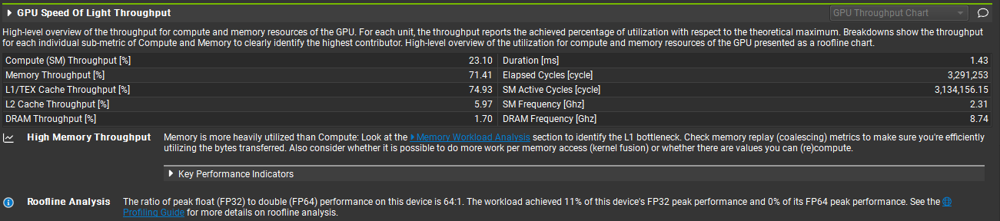 |
|  | 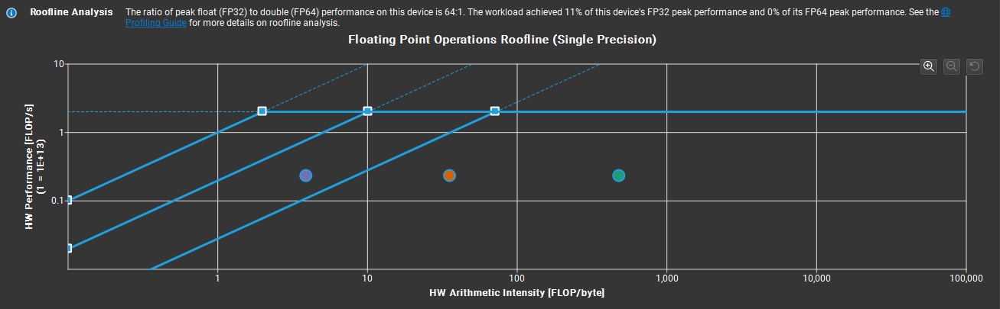 |
|  | 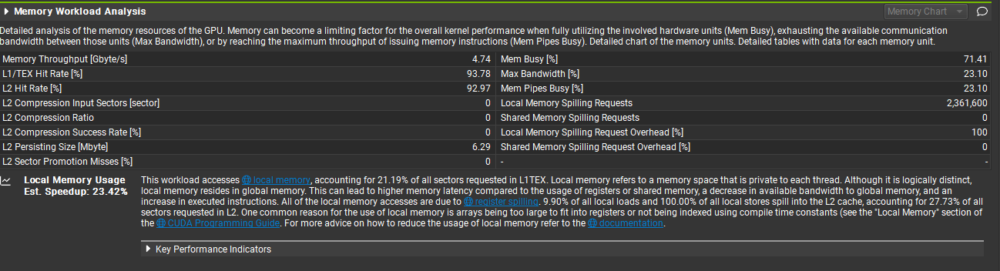 |
|  | 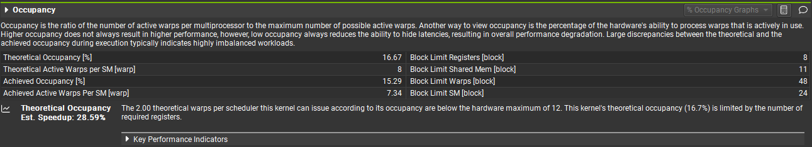 |

### Backward dK/dV Kernel

| Before (FP32 Baseline) | After (mixed precision / WMMA module) |
|---|---|
|  | 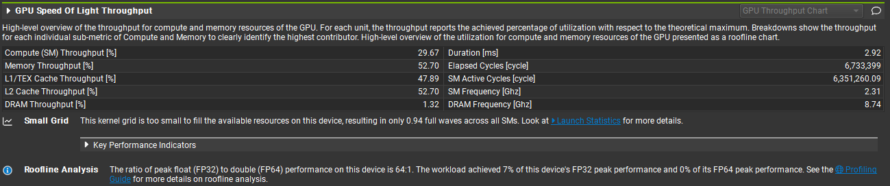 |
|  | 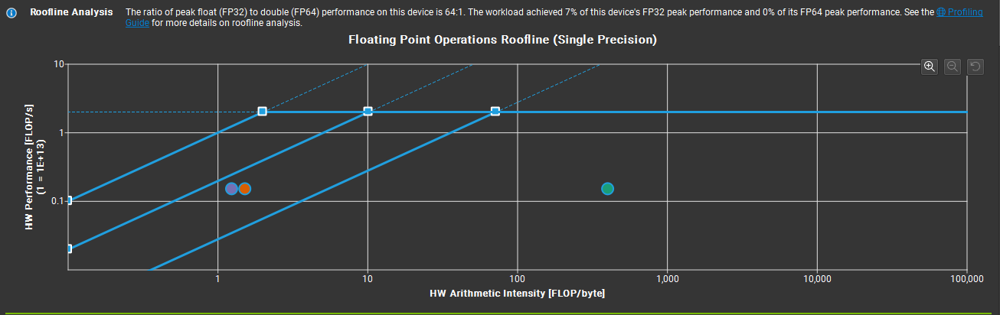 |
|  | 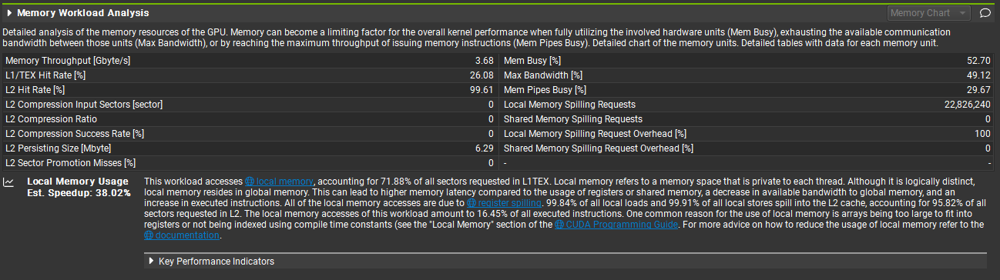 |
|  | 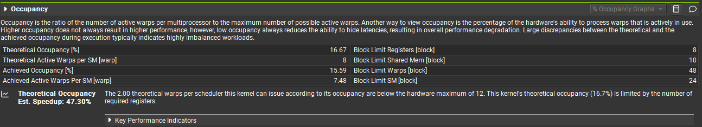 |

### Profiling Summary

1. All three kernels share the same bottleneck: occupancy ~10% due to shared memory (16KB per block) and register pressure
2. dK/dV is the worst performer: 71.88% local memory usage from 256+ registers per thread, 22.8M spill requests
3. Tried 6 optimizations targeting these bottlenecks (see optimization section above)

## Project Structure

```
flashattn-cuda/
├── cuda/
│   ├── flash_attn_kernel.cu       # FP32 baseline forward+backward
│   └── flash_attn_wmma.cu         # WMMA Tensor Core forward + mixed precision backward
├── ref/
│   └── naive_attn.py              # O(N²) reference
├── tests/
│   ├── test_forward.py            # forward 9/9
│   ├── test_backward.py           # backward 9/9
│   └── test_wmma.py               # WMMA 9/9
├── bench/
│   ├── bench_forward.py           # forward benchmark (CSV)
│   ├── bench_backward.py          # backward benchmark (CSV)
│   ├── roofline_analysis.py       # effective BW analysis
│   └── results/                   # CSV + .ncu-rep files
├── docs/
│   └── profiling/                 # ncu screenshots (before + after)
├── setup.py                       # flash_attn_cuda + flash_attn_wmma
├── LICENSE                        # MIT
└── README.md
```

----

## Build & Run

### CUDA (WSL2, RTX 4060 Ti)

```bash
# sm_89. CUDA_HOME is required.
CUDA_HOME=/usr/local/cuda-12.8 pip install -e . --break-system-packages

# correctness
python3 tests/test_forward.py
python3 tests/test_backward.py
python3 tests/test_wmma.py

# benchmark
python3 bench/bench_forward.py
python3 bench/bench_backward.py
```

### Jetson AGX Orin 64GB

```bash
# change gencode in setup.py: sm_89 -> sm_87
CUDA_HOME=/usr/local/cuda pip install -e . --break-system-packages
```

not yet profiled. future work.

## Hardware

| Platform | GPU | Memory | Profiler |
|---|---|---|---|
| RTX 4060 Ti | Ada Lovelace sm_89 | GDDR6 288 GB/s | Nsight Compute |
| Jetson AGX Orin 64GB | Ampere sm_87 | shared LPDDR5 204.8 GB/s | Nsight Compute (future work) |

## Roadmap

- [x] Forward kernel (online softmax tiling)
- [x] Backward kernel (dQ, dK, dV with recomputation)
- [x] Nsight Compute profiling (forward + backward)
- [x] FP16 mixed precision experiment
- [x] WMMA Tensor Core + half2 optimization (v1)
- [x] Multi-warp attempt (failed, rolled back)
- [x] Shared memory bank conflict padding (+8)
- [ ] Jetson AGX Orin profiling
- [ ] Cross-platform comparison table
- [ ] Causal masking support

## References

- Dao et al., "FlashAttention: Fast and Memory-Efficient Exact Attention with IO-Awareness" (NeurIPS 2022)
- Dao, "FlashAttention-2: Faster Attention with Better Parallelism and Work Partitioning" (2023)
- NVIDIA CUDA C++ Programming Guide

## License

MIT
