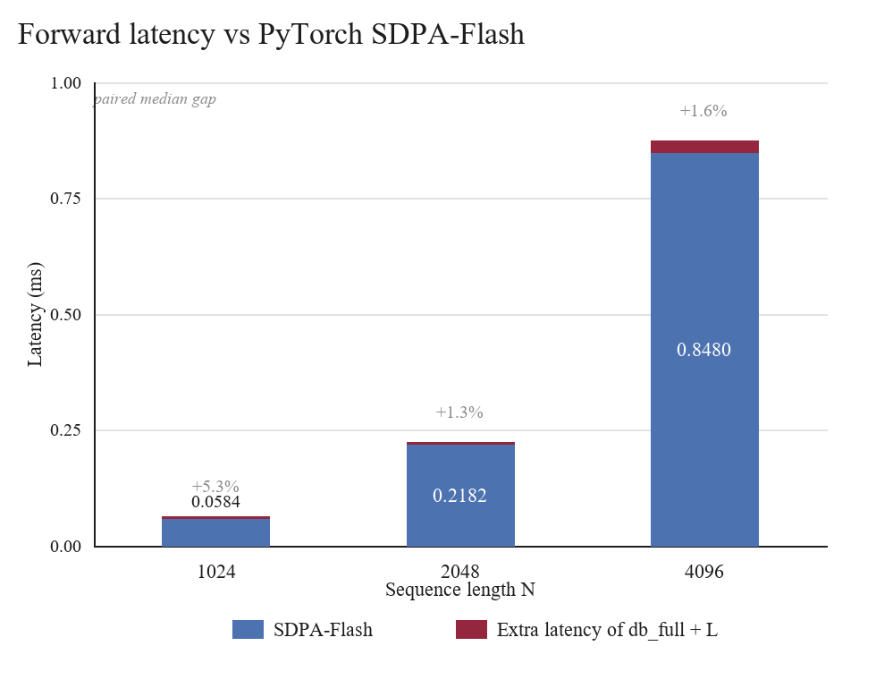
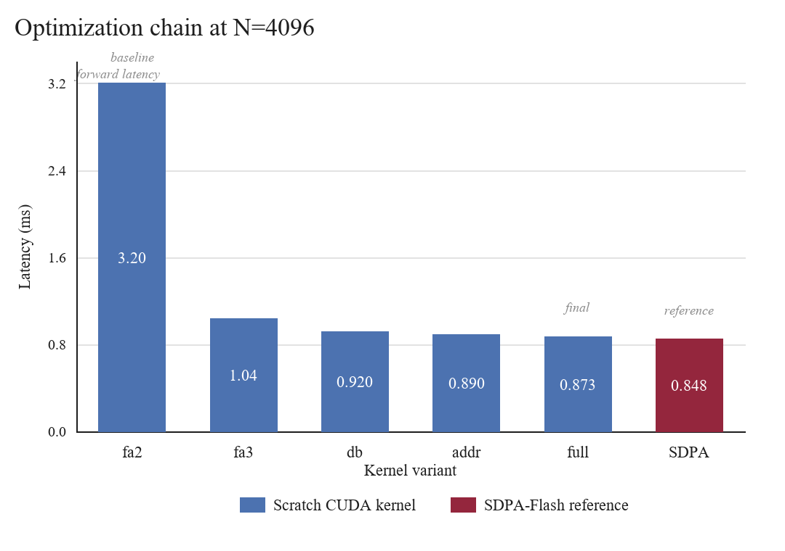
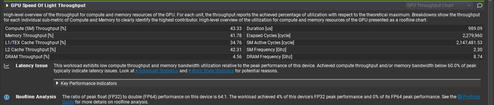
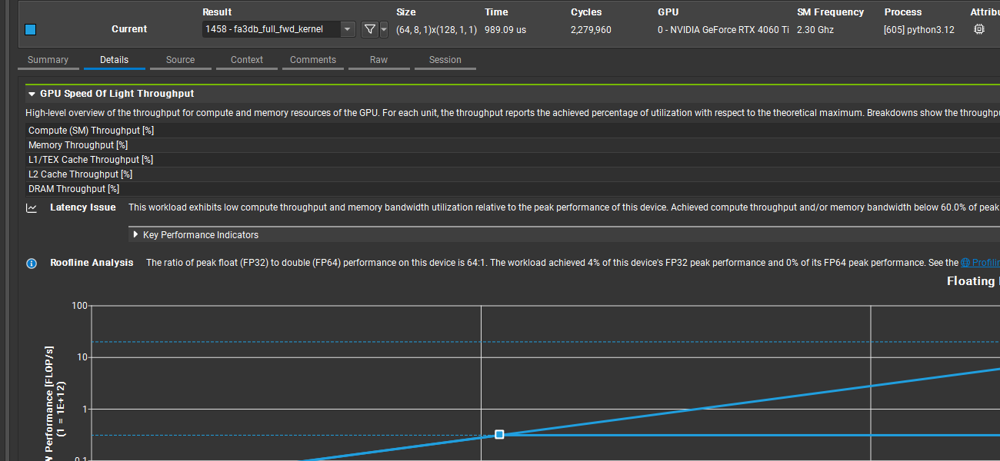
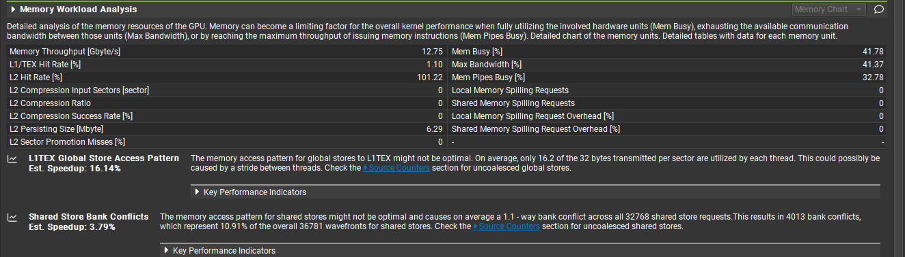
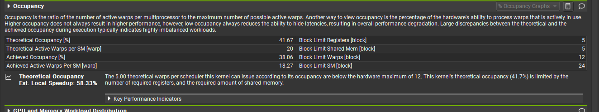

# flashattn-cuda

I wrote FlashAttention kernels from scratch in CUDA and pushed the forward path
until it got close to PyTorch's SDPA Flash backend on an RTX 4060 Ti.

The current best kernel is:

```text
cuda/flash_attn_fa3_db_full.cu
```

It is still behind SDPA, but the remaining gap is small:

| N | my kernel, +L | PyTorch SDPA-Flash | gap |
|---:|---:|---:|---:|
| 1024 | 0.0620 ms | 0.0584 ms | +5.3% |
| 2048 | 0.2221 ms | 0.2182 ms | +1.3% |
| 4096 | 0.8726 ms | 0.8480 ms | +1.6% |

Tested on RTX 4060 Ti, CUDA 12.8, PyTorch 2.10.0+cu128, B=1, H=8, D=64,
FP16 input, FP32 accumulate, non-causal forward. The numbers above are 10-run
paired medians from `bench/bench_fa3_headline.py`.

<p align="center">
  
</p>

## Why I Built This

Calling `torch.nn.functional.scaled_dot_product_attention` is easy. I wanted to
know what the kernel is actually doing.

So this repo keeps the whole trail:

| Stage | What changed |
|---|---|
| FP32 baseline | plain tiled FlashAttention forward/backward |
| WMMA path | first Tensor Core attempt |
| fa3 | direct `mma.sync`, register softmax, no shared S/P round trip |
| fa3-db | K/V `cp.async` double buffer |
| db_addr | removed a lot of repeated integer address work |
| db_full | full-tile fast path for common benchmark sizes |

At `N=4096`, the chain moved from about 3.2 ms to about 0.873 ms.

<p align="center">
  
</p>

## Nsight Compute Snapshot

I also profiled the direct `fa3` kernel and the final `db_full` kernel with
Nsight Compute on the same `N=4096` shape. This is a single profiled launch, so
it is not the headline benchmark. The event-timed paired benchmark above is the
latency number I quote.

The point of this profile is not just "lower time." The final kernel does more
useful work per cycle after K/V prefetching, address cleanup, and the full-tile
path.

| Metric | fa3 before | db_full after |
|---|---:|---:|
| Duration | 1.38 ms | 0.987 ms |
| Compute throughput | 35.18% | 43.32% |
| Memory throughput | 35.18% | 41.84% |
| Achieved occupancy | 43.22% | 38.01% |

What changed:

| Signal | Read |
|---|---|
| Duration went down | the final kernel is doing less wasted work |
| Compute throughput went up | Tensor Core work is fed better |
| Memory throughput went up | `cp.async` and the K/V pipeline are actually visible |
| Occupancy went down | not a regression by itself, because the final kernel uses more registers and shared memory |

The final kernel is faster even with lower achieved occupancy. That is the main
profiling lesson here: occupancy was not the only score to chase.

The full Nsight Compute reports, text exports, and original uncropped UI
captures are kept under `docs/profiling/ncu/` and `docs/profiling/ncu_sections/`.

I kept the old Nsight screenshots from the first FP32 kernel too. The old
screenshots and the current db_full screenshots are different benchmark shapes,
so I do not use the duration as a strict apples-to-apples latency claim. They
are here to show how the profiler picture changed.

| Metric | old FP32 kernel screenshot | current db_full report |
|---|---:|---:|
| Shape | N=1024, FP32 | N=4096, FP16 input / FP32 accumulate |
| Duration | 1.14 ms | 0.989 ms |
| Compute throughput | 25.30% | 43.33% |
| Memory throughput | 25.30% | 41.78% |
| L1/TEX throughput | 25.70% | 34.76% |
| L2 throughput | 7.81% | 42.31% |
| DRAM throughput | 4.46% | 4.56% |
| Theoretical occupancy | 10.42% | 41.67% |
| Achieved occupancy | 7.90% | 38.06% |
| Active warps per SM | 3.79 | 18.27 |
| Local spill signal | visible in Memory Workload | 0 local memory spilling requests |

Actual Nsight Compute GUI captures:

| Section | Before | After |
|---|---|---|
| GPU Speed of Light |  |  |
| Roofline |  |  |
| Memory Workload |  |  |
| Occupancy |  |  |

The full `.ncu-rep` files and text exports are kept under `docs/profiling/ncu/`
and `docs/profiling/ncu_sections/`.

## Current Kernel

The final forward kernel uses:

| Part | Choice |
|---|---|
| QK | `mma.sync.m16n8k16` |
| PV | `mma.sync.m16n8k16` |
| Softmax | online softmax in registers |
| K/V load | two-stage `cp.async` |
| Shared memory | K/V tiles only |
| Fast path | predicate-free when N is a full tile |
| Output | `O` half, `L` float |

The benchmark uses `forward()` with `L` enabled. There is an O-only path, but I
do not use it for the headline comparison because PyTorch's Flash backend also
computes softmax logsumexp internally.

## Tried

This is the part I care about most. The final number is not just one lucky
kernel. I tried the obvious paths, kept the useful ones, and left the dead ends
in the repo or notes when they explained something.

The headline kernel is still `db_full(+L)`. Rows marked race or ablation are not
used for the main SDPA comparison.

| Attempt | What happened | Verdict |
|---|---|---|
| FP32 tiled baseline | worked as the reference path, but it was much slower | kept as baseline |
| WMMA path | first Tensor Core version, useful but still carried too much overhead | superseded |
| fa3 | direct `mma.sync`, register softmax, no shared S/P round trip | kept in chain |
| fa3-db | added two-stage K/V `cp.async` | kept in chain |
| db_addr | removed repeated shared/global address work; SASS integer ops dropped hard | kept in chain |
| db_full | removed full-tile predicates for N divisible by the tile size | current headline kernel |
| O-only race path | split loop, last sync removed, N=2048/4096 specialization, `.ca` load path; faster than db_full O-only, but claim-grade SDPA ratios were still 1.0035 at N=2048 and 1.0063 at N=4096 | borderline, not headline |
| fp16-acc QK | about 21-24% faster, but changes the numerical contract and breaks down on larger logits | ablation only |
| BC=64 tile | correct, but shared memory footprint cut residency too much | rejected |
| BC=16 tile | REG 72, LOCAL 0, SHARED 13.8KB, correctness 18/18; still slower because the K/V loop, barriers, and online-softmax updates doubled | rejected |
| softmax/PV source interleave | correct and nearly bit-identical, but slower in paired runs | rejected |
| cross-iteration precompute | correct, but the extra live state hurt scheduling more than it helped | rejected |
| launch bounds, max register count, PAD changes, static N only | no stable win in paired runs | rejected |

Older FP32 and WMMA trail:

| # | Attempt | Result | Takeaway |
|---:|---|---|---|
| 1 | tile size 32 -> 16 plus `launch_bounds` | 11.18 ms -> 15.44 ms | K/V loop count doubled while register pressure stayed high |
| 2 | FP16 shared memory | 11.18 ms -> 16.28 ms | occupancy improved, but `half2float` conversion became the cost |
| 3 | WMMA 16x16 | 11.18 ms -> 11.83 ms | Tensor Cores were not enough with small tiles and scalar softmax between MMA phases |
| 4 | WMMA plus `half2` load | 11.63 ms at N=4096, 0.09 ms at N=128 | removed spill and helped small N, but still not enough for large N |
| 5 | multi-warp, 4 warps per block | rolled back | about 35 KB shared memory per block cut residency too hard |
| 6 | `sQ/sK/sV` +8 padding | 10.41 ms at N=4096 | shared load bank conflict dropped from 4.6-way to 2.7-way |
| 7 | `sO` +1 padding | slower | conflict barely moved, so residual conflict was not from the output accumulator |
| 8 | `sP` +8 padding | 10.41 ms -> 10.55 ms | store conflict improved, but runtime regressed from shared-memory pressure |

The BC=16 result is a good example of why I do not treat occupancy as a goal by
itself. It lowered the resource footprint enough to be a 7-block-per-SM
candidate, but the extra loop and synchronization work was larger than the
latency-hiding gain.

## Files

| File | Notes |
|---|---|
| `cuda/flash_attn_kernel.cu` | FP32 baseline. Kept as the comparison anchor. |
| `cuda/flash_attn_wmma.cu` | older WMMA path |
| `cuda/mma_probe.cu` | checks `mma.sync` and `ldmatrix` layouts on the GPU |
| `cuda/flash_attn_fa3.cu` | direct `mma.sync` version |
| `cuda/flash_attn_fa3_db.cu` | adds `cp.async` double buffering |
| `cuda/flash_attn_fa3_db_addr.cu` | cuts address generation overhead |
| `cuda/flash_attn_fa3_db_full.cu` | current best kernel |
| `cuda/flash_attn_fa3_bc64.cu` | negative ablation |
| `cuda/flash_attn_fa3_db_full_intl.cu` | negative ablation |
| `cuda/flash_attn_fa3_fp16acc.cu` | precision trade-off ablation, not headline |
| `cuda/flash_attn_fa3_race.cu` | O-only API-latency race path, not headline |
| `cuda/flash_attn_fa3_bc16.cu` | occupancy experiment, rejected |
| `bench/bench_fa3_headline.py` | canonical db_full(+L) vs SDPA comparison |
| `bench/bench_fa3_race_paired.py` | O-only race path check |
| `bench/bench_fa3_bc16.py` | BC=16 paired check |

## Correctness

The fa3 line is checked against a half-cast PyTorch reference.

| Check | Result |
|---|---|
| `tests/test_mma_probe.py` | 3/3 layout probes pass |
| `tests/test_fa3_db_full.py` | 19/19 correctness configs pass |
| `tests/test_fa3_race.py` | 18/18 race path configs pass |
| `tests/test_fa3_bc16.py` | 18/18 BC=16 configs pass |
| non-aligned N | included |
| direct FP16 input | included |
| amplified-value stress cases | included |
| typical final-kernel error | `O` around `5.3e-4`, `L` around `1.9e-6` |

The old FP32 forward/backward tests are still in the repo. The newest headline
result is forward-only.

## Memory Baseline

The older FP32 baseline still shows the original FlashAttention point.

At `N=4096`, the naive attention path used about 1576 MB. The FlashAttention
baseline used about 40 MB.

That is a 39.16x memory saving. It is not a speedup number.

## Build And Run

The repo was developed on WSL2 Ubuntu with CUDA 12.8.

```bash
CUDA_HOME=/usr/local/cuda-12.8 pip install -e . --break-system-packages
```

Main checks:

```bash
python3 tests/test_mma_probe.py
python3 tests/test_fa3_db_full.py
python3 bench/bench_fa3_headline.py
```

Other useful scripts:

```bash
python3 bench/bench_fa3_final.py
python3 bench/bench_fa3_variants.py
python3 bench/profile_fa3_once.py
```

Before quoting register counts, rebuild and check the actual `.so`. I have hit
stale extension binaries before.

## Troubleshooting Log

These are older setup notes from the first version of the project. Some of them
are not part of the current CUDA kernel path, but they explain the environment
breakages I hit while setting up the RTX 4060 Ti machine.

Old setup:

```text
RTX 4060 Ti
Windows 11
Python 3.11
CUDA 12.1
```

| # | Problem | Cause | Fix |
|---:|---|---|---|
| 1 | `'torch._C._CudaDeviceProperties' object has no attribute 'total_mem'` | PyTorch property name changed | use `props.total_memory` |
| 2 | missing `max_shared_memory_size` | the field was not present in that PyTorch build | use `torch.cuda.get_device_capability(0)` and CUDA device attributes |
| 3 | `ModuleNotFoundError: No module named 'awq'` | `autoawq` was not installed | `pip install wheel`, then `pip install autoawq --no-build-isolation` |
| 4 | `autoawq` downgraded torch | `autoawq==0.2.6` depended on torch 2.3.1 | pin the torch/AWQ stack together |
| 5 | HuggingFace 401 or repo not found | gated model access, deleted AWQ repo, or missing login | run `huggingface-cli login` and use an available repo |
| 6 | tokenizer had no padding token | Llama tokenizer had no `pad_token` | `tokenizer.pad_token = tokenizer.eos_token` |
| 7 | AWQ DLL load failure, 0.6 to 0.9 tok/s | `autoawq-kernels` and torch did not match | use the stable stack below |
| 8 | `cannot import name 'shard_checkpoint'` | transformers version was too new for that AWQ stack | `pip install transformers==4.45.0` |
| 9 | torch installed as CPU build | pip pulled the default wheel | install torch from the CUDA wheel index |
| 10 | NumPy 2.x binary mismatch | torch 2.3.1 expected NumPy 1.x ABI | `pip install "numpy<2"` |
| 11 | `torchvision register_fake` error | torchvision expected newer torch APIs | remove `torchvision` and `torchaudio` |
| 12 | Nsight Compute said no kernels were profiled | wrong `--kernel-name` | inspect kernel names and pass the exact one |

Stable package set from that phase:

```text
Python 3.11
torch==2.3.1+cu121
transformers==4.45.0
autoawq==0.2.6
autoawq-kernels==0.0.7
numpy<2
huggingface-hub
tokenizers
accelerate
```

The torch install had to use the CUDA index:

```bash
pip install torch==2.3.1+cu121 --index-url https://download.pytorch.org/whl/cu121
```

For the old Nsight Compute profiling issue, the important detail was the exact
kernel name:

```text
wrong: flash_attn_fwd
right: flash_attn_fwd_kernel
```

Jetson AGX Orin notes for the later port:

| Item | Note |
|---|---|
| torch install | use the JetPack SDK path instead of random pip wheels |
| CUDA version | JetPack 6.x uses CUDA 12.x, but the exact minor version matters |
| AWQ kernels | aarch64 wheels may not exist, so source builds may be needed |
| shared memory | check attributes on-device instead of assuming desktop values |
| build flag | Orin is sm_87, while RTX 4060 Ti is sm_89 |

## Limits

The current fa3 result is intentionally narrow:

| Covered | Not covered yet |
|---|---|
| forward | fa3 backward |
| non-causal | causal mask |
| D=64 | D=128 |
| fixed dense Q/K/V | varlen, dropout, GQA, MQA |
| RTX 4060 Ti | cross-GPU generality |

So the claim is simple:

```text
scratch CUDA FlashAttention forward, close to PyTorch SDPA-Flash on one stated setup
```

Not a library replacement. Not a broad hardware claim. Just a CUDA kernel taken
far enough that the production backend is only a few percent away.
