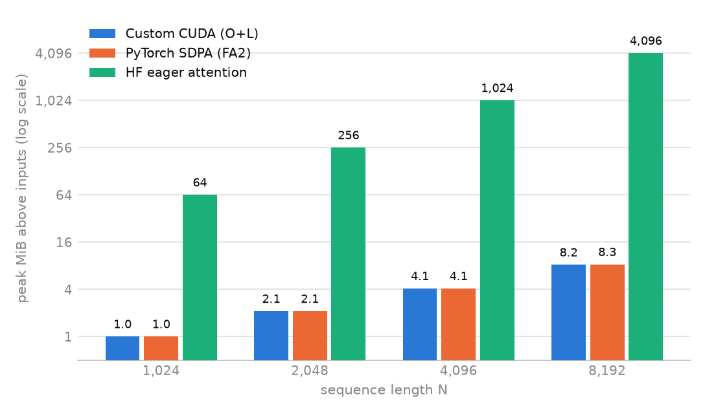

# flashattn-cuda

A FlashAttention-2 forward kernel written from scratch in CUDA without CUTLASS, for the RTX 4060 Ti.
It takes fp16 inputs, accumulates in fp32, and supports head dim 64 and non-causal attention only.

Query and key lengths are equal (N_q = N_kv). There is no KV cache and no single-query decode path,
and attention is non-causal, so this is the bidirectional full-attention shape rather than LLM prefill.

## Latency vs PyTorch SDPA (FlashAttention-2 backend)

B=1, H=8, D=64, fp16. Each benchmark run is 10 paired reps with alternating order;
the table is the median of three such runs. Positive gap = custom slower.

| N | Custom ms | Custom TFLOPS | SDPA ms | SDPA TFLOPS | gap |
|---:|---:|---:|---:|---:|---:|
| 1024 | 0.0642 | 33.4 | 0.0624 | 34.4 | +2.98% |
| 2048 | 0.2142 | 40.1 | 0.2139 | 40.2 | +0.76% |
| 4096 | 0.8383 | 41.0 | 0.8302 | 41.4 | +0.90% |

At N=1024 the per-rep gap ranges from -15% to +15% across reps, so that row is dominated by
launch and dispatch noise rather than kernel time.

FLOPs counted as 4·N²·D·H. For fp16 multiply with fp32 accumulate this GPU peaks at
34 SM × 512 FLOP/clk × 3.12 GHz = 54.3 TFLOPS, and the sustained clock under load is lower.

## Peak memory

MiB above the Q/K/V inputs. HF eager = Transformers `eager_attention_forward`, unmodified.

| N | Custom CUDA (O+L) | PyTorch SDPA (FA2) | HF eager |
|---:|---:|---:|---:|
| 1024 | 1.0 | 1.0 | 64.0 |
| 2048 | 2.1 | 2.1 | 256.0 |
| 4096 | 4.1 | 4.1 | 1024.0 |
| 8192 | 8.2 | 8.3 | 4096.0 |

## Kernel

`cuda/attention_forward.cu`. Four warps per block, each owns 16 query rows.
QK and PV on `mma.sync`, softmax and O kept in registers, K/V double-buffered with `cp.async`.
Not implemented: causal, dropout, varlen, GQA, backward.

## Files

`bench/compare_pytorch.py`, `bench/compare_memory.py`, `tests/test_attention_forward.py`.
Run record: `bench/results/`. Earlier kernels: `experiments/`. Profiles: `docs/profiling/`.
