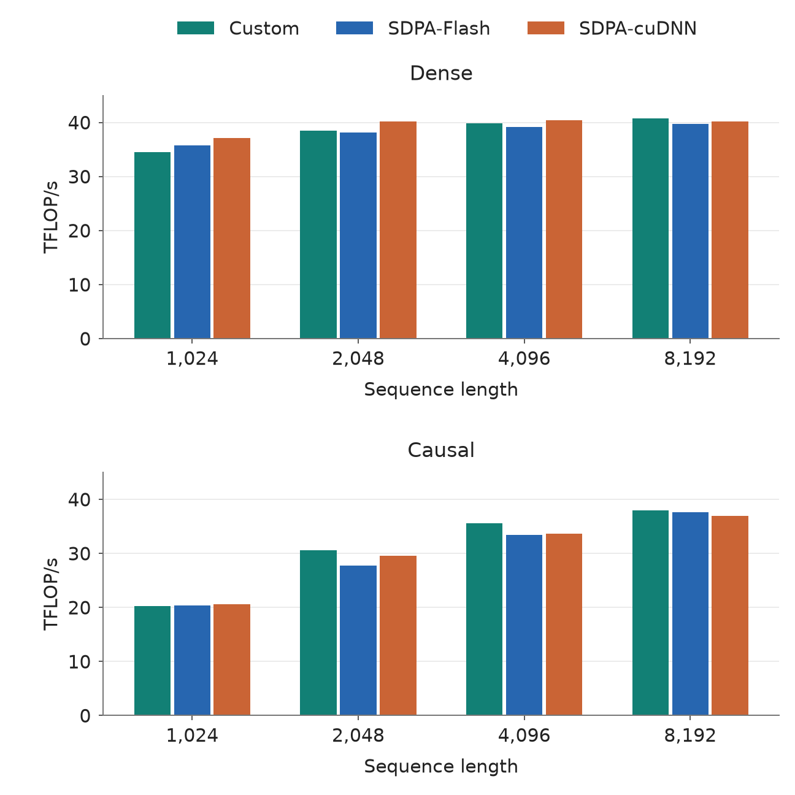

# flashattn-cuda

Flash-Attention and Flash-Attention-2 inference kernels written in **CUDA C++
with inline PTX**, especially for **RTX 4060 Ti**.

Benchmarks compare kernel latency with **PyTorch SDPA-Flash and cuDNN**, and
model serving across **low latency, high throughput and long context**.

## Implementation

- Tensor Core `mma.sync` for QK and PV, with FP16 operands and FP32 accumulation.
- Online softmax and output accumulation in registers.
- Four warps per block; double-buffered K/V tiles loaded with `cp.async`.

The standalone FA2 forward supports **dense/causal attention, GQA and unequal
query/KV lengths**. Earlier FA1/FP32 kernels remain in [experiments](experiments/).

[Read the forward loop](cuda/flash_fwd_kernel.h) | [Source map](cuda/README.md)

## Kernel Performance

**RTX 4060 Ti 8 GB, PyTorch 2.10.0+cu128.** Batch size 1, eight Q/KV heads,
head dimension 64. Flash and cuDNN are separately forced SDPA backends.
FP16 inputs, FP32 accumulation; warmed O-only API time, without CUDA Graphs.

TFLOP/s is calculated from QK/PV FLOPs and the median of three per-run median
latencies.

**Execution time (ms), lower is better:**

| Mask | Sequence length | Custom | SDPA-Flash | SDPA-cuDNN |
|---|---:|---:|---:|---:|
| Dense | 1024 | 0.06227 | 0.05998 | 0.05782 |
| Dense | 2048 | 0.22313 | 0.22501 | 0.21361 |
| Dense | 4096 | 0.86249 | 0.87860 | 0.85070 |
| Dense | 8192 | 3.37455 | 3.45639 | 3.41856 |
| Causal | 1024 | 0.05296 | 0.05270 | 0.05217 |
| Causal | 2048 | 0.14025 | 0.15490 | 0.14524 |
| Causal | 4096 | 0.48298 | 0.51368 | 0.51085 |
| Causal | 8192 | 1.81162 | 1.82800 | 1.86083 |

The full benchmark covers **34 cases**, including batch sizes 1-8, MHA/GQA
and sequence lengths 512-8192. Custom throughput spans **34.48-41.74 TFLOP/s
for dense** and **20.28-39.76 TFLOP/s for causal** attention.

[All 34 cases and FLOP accounting](docs/figures/kernel-throughput.md)
| [Per-case comparisons](docs/figures/kernel-comparison.md)
| [Measurement protocol](docs/serving/backend_overview_2026-09-22/README.md)

## Serving Performance

The vLLM 0.19.0 study compared three configurations with the same models and
engine settings:

| Configuration | Prefill | Decode |
|---|---|---|
| Native Flash | vLLM FlashAttention | vLLM FlashAttention |
| Custom decode-only | vLLM FlashAttention | Custom paged decode |
| Custom prefill + decode | Custom prefill | Custom paged decode |

**252 measurements:** 14 settings, three configurations, three runs and two
execution modes. FP16, 128 output tokens per request, 2048-token chunked
prefill, prefix caching off; startup and warmup excluded.

Results use the median of three runs; latency panels show request p50s.
Serving comparisons below use these same medians relative to Native Flash.

TTFT = time to first token; TPOT = average time per subsequent output token.

Serving results are from the archived September 20-21 implementation;
kernel results are from September 22. The current build is standalone forward
attention. [Measured revisions and raw records](docs/evaluation.md)

### Low Latency

**TinyLlama-1.1B, one request at a time, 128-1920 input tokens.** Measured TTFT,
TPOT, inter-token and end-to-end latency, including p50/p95/p99.
CUDA Graphs enabled.

Measurements: TTFT and TPOT

**p50 TTFT (ms), CUDA Graphs**

| Input tokens | Native Flash | Custom decode-only | Custom prefill + decode |
|---:|---:|---:|---:|
| 128 | 16.874 | 20.619 | 20.048 |
| 512 | 33.827 | 34.323 | 34.194 |
| 1,024 | 61.585 | 62.645 | 61.220 |
| 1,920 | 115.753 | 117.562 | 114.051 |

**p50 TPOT (ms), CUDA Graphs**

| Input tokens | Native Flash | Custom decode-only | Custom prefill + decode |
|---:|---:|---:|---:|
| 128 | 8.255 | 8.313 | 8.302 |
| 512 | 8.261 | 8.361 | 8.355 |
| 1,024 | 8.282 | 8.432 | 8.433 |
| 1,920 | 8.382 | 8.495 | 8.517 |

[Eager and CUDA Graph measurements](docs/figures/serving-measurements.md#low-latency)

With CUDA Graphs, custom prefill + decode TTFT was **within 1.5% of native
Flash** at 512-1920 tokens; TPOT was **1.1-1.8% higher**.
The 128-token TTFT varied substantially between runs.

### High Throughput

**TinyLlama-1.1B, 512 input tokens, 2-32 concurrent requests.** Measured total
output tokens/s, TTFT, TPOT and request-latency distributions.

Measurements: output tokens/s and TPOT

**Output tokens/s, eager**

| Concurrent requests | Native Flash | Custom decode-only | Custom prefill + decode |
|---:|---:|---:|---:|
| 2 | 156.728 | 169.132 | 170.685 |
| 4 | 287.798 | 332.920 | 327.418 |
| 8 | 528.461 | 598.362 | 612.112 |
| 16 | 952.792 | 1026.217 | 1102.025 |
| 32 | 1599.307 | 1717.310 | 1779.234 |

**p50 TPOT (ms), eager**

| Concurrent requests | Native Flash | Custom decode-only | Custom prefill + decode |
|---:|---:|---:|---:|
| 2 | 12.088 | 11.280 | 11.179 |
| 4 | 13.087 | 10.806 | 11.013 |
| 8 | 13.459 | 11.869 | 11.749 |
| 16 | 14.664 | 13.205 | 12.507 |
| 32 | 17.429 | 15.893 | 15.537 |

**Output tokens/s, CUDA Graphs**

| Concurrent requests | Native Flash | Custom decode-only | Custom prefill + decode |
|---:|---:|---:|---:|
| 2 | 224.548 | 225.102 | 224.256 |
| 4 | 418.972 | 419.205 | 423.398 |
| 8 | 744.520 | 735.773 | 756.012 |
| 16 | 1250.666 | 1215.820 | 1261.472 |
| 32 | 1855.617 | 1803.594 | 1875.279 |

**p50 TPOT (ms), CUDA Graphs**

| Concurrent requests | Native Flash | Custom decode-only | Custom prefill + decode |
|---:|---:|---:|---:|
| 2 | 8.538 | 8.544 | 8.533 |
| 4 | 8.618 | 8.630 | 8.642 |
| 8 | 9.456 | 9.522 | 9.533 |
| 16 | 10.888 | 11.236 | 11.017 |
| 32 | 14.446 | 15.133 | 14.486 |

[All throughput and latency measurements](docs/figures/serving-measurements.md#high-throughput)

Custom prefill + decode improved throughput by **8.9-15.8% in eager mode**.
With CUDA Graphs the difference was **-0.1% to +1.5%**, with TPOT within 1.2%
of native Flash. Higher-concurrency TTFT varied between runs.

### Long Context

**Qwen2.5-0.5B, one request, 2048-32640 input tokens.** Measured TTFT, TPOT,
end-to-end latency, request failures and KV-cache capacity from engine logs.
CUDA Graphs enabled.

Measurements: TTFT and TPOT

**p50 TTFT (s), CUDA Graphs**

| Input tokens | Native Flash | Custom decode-only | Custom prefill + decode |
|---:|---:|---:|---:|
| 2,048 | 0.0618 | 0.0617 | 0.0604 |
| 4,096 | 0.1252 | 0.1266 | 0.1218 |
| 8,192 | 0.2830 | 0.2869 | 0.2757 |
| 16,384 | 0.7188 | 0.7260 | 0.6929 |
| 32,640 | 2.0547 | 2.0884 | 1.9829 |

**p50 TPOT (ms), CUDA Graphs**

| Input tokens | Native Flash | Custom decode-only | Custom prefill + decode |
|---:|---:|---:|---:|
| 2,048 | 4.616 | 4.606 | 4.602 |
| 4,096 | 4.700 | 4.655 | 4.656 |
| 8,192 | 4.868 | 4.826 | 4.832 |
| 16,384 | 5.300 | 5.198 | 5.195 |
| 32,640 | 5.896 | 5.906 | 5.918 |

[Eager and CUDA Graph measurements](docs/figures/serving-measurements.md#long-context)

With CUDA Graphs, custom prefill + decode had **2.2-3.6% lower TTFT** across
all five lengths; TPOT changed by -2.0% to +0.4%. KV-cache records describe
engine capacity, not per-request peak memory.

[Full serving report](docs/serving/prefill_campaign_2026-09-20/REPORT.md)

## Code And Records

- [Kernel source map](cuda/README.md): forward loop, memory operations, softmax and PTX.
- [Build, API and tests](docs/usage.md): the measured `sm_89` environment.
- [Evaluation details](docs/evaluation.md): conditions, timing tables and raw results.
- [Figure data and generation](docs/figures/README.md): plots from preserved measurements.
- [Optimization history](experiments/): earlier kernels and the FP32 baseline.
- [FlashAttention-2 paper](https://arxiv.org/abs/2307.08691): algorithm reference.

The active build contains standalone forward attention. The vLLM integration
and decode kernels are preserved in [Git history](https://github.com/Bias92/flashattn-cuda/tree/d4d4f37f6d4129f4a42f521fe93282e8ae7b7beb).
Other GPUs have not been evaluated.
